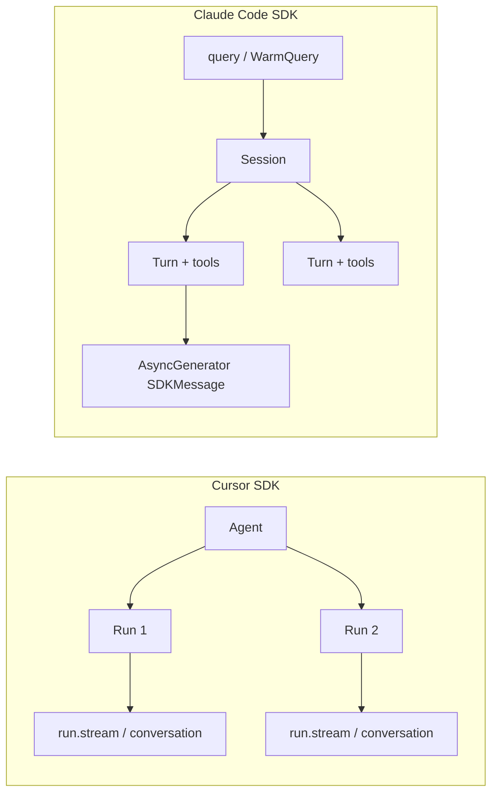

# Cursor SDK 与 Claude Code SDK 差异报告

> 对比基准：`docs/cursor_typescript_sdk.md`（`@cursor/sdk`）与 `docs/claudecode_typescript_sdk.md`（`@anthropic-ai/claude-agent-sdk`）。  
> 本仓库 **cursor-web-chat** 基于 Cursor SDK 的 **local 运行时** 实现；下文在通用差异之外，会标注对本项目有直接影响的点。

---

## 1. 定位与总体差异

| 维度 | Cursor SDK (`@cursor/sdk`) | Claude Code SDK (`@anthropic-ai/claude-agent-sdk`) |
|------|---------------------------|-----------------------------------------------------|
| 产品归属 | Cursor 官方，与 IDE / CLI / Cloud Agents 同一套 agent 栈 | Anthropic 官方，封装 Claude Code CLI |
| 主要入口 | `Agent.create()` / `Agent.resume()` / `agent.send()` | `query()` / `startup()` |
| 执行模型 | **本地**：agent 循环内联在 Node 进程；**云端**：Cursor 托管 VM 或自托管池 | 通过 **子进程** 拉起捆绑的 Claude Code 原生二进制（按平台 optional dependency） |
| 运行时统一性 | 同一套 `Agent` API，`local` / `cloud` 二选一 | 本质上是「驱动 Claude Code CLI」；无与 Cursor 对等的 cloud agent VM 抽象 |
| 模型 | Cursor 账号模型目录（Composer 系列等），经 `Cursor.models.list()` 发现 | Claude 模型别名 / 全名（opus、sonnet、haiku 等），`query` 内 `supportedModels()` |
| 计费 | Cursor 用量池，`CURSOR_API_KEY` | Anthropic / Claude 账号计费路径（CLI 侧 `accountInfo()` 等） |

**一句话**：Cursor SDK 是「多运行时 agent 平台 API」；Claude Code SDK 是「以 `query()` 为中心的 Claude Code CLI 绑定层」，能力更贴近 Claude Code 产品本身。

---

## 2. 安装与运行环境

| 项目 | Cursor SDK | Claude Code SDK |
|------|------------|-----------------|
| 包名 | `@cursor/sdk` | `@anthropic-ai/claude-agent-sdk` |
| Node 版本 | **≥ 22.13** | 文档未硬性写死同一门槛；依赖所选 `executable`（node/bun/deno） |
| 原生依赖 | 按平台的 `@cursor/sdk-<os>-<arch>`（沙箱、ripgrep 等） | 按平台的 `@anthropic-ai/claude-agent-sdk-<platform>`（**捆绑 Claude Code 二进制**） |
| 首次本地成本 | 第一次 local acquire 才加载执行器（懒加载） | 每次 `query()` 需 spawn CLI 子进程；可用 `startup()` 预热 |
| 单文件编译 | 未在文档中强调 bun compile 场景 | 明确说明 `bun build --compile` 需 `extractFromBunfs()` 提取二进制 |

**对本项目**：cursor-web-chat 要求 Node 22.13+，并依赖 Cursor 本地内联执行器，**不会**也不适合换成「子进程 CLI」模型。

---

## 3. 核心概念映射

两套 SDK 的「会话粒度」不同，迁移时最容易踩坑。

| 概念 | Cursor SDK | Claude Code SDK |
|------|------------|-----------------|
| 长期容器 | **Agent**（`agentId`，本地 `agent-<uuid>`，云端 `bc-<uuid>`） | **Session**（`sessionId`，UUID） |
| 单次用户提问 | **Run**（`run.id`，独立流、状态、取消、`conversation()`） | 一次 `query()` 调用内的多 **turn**（工具往返）；多轮可用 `streamInput()` 或连续 `query` + `resume` |
| 流事件载体 | `SDKMessage`（按 `run_id` 区分） | `SDKMessage`（按 `session_id` 区分，类型集合更大） |
| 恢复会话 | `Agent.resume(agentId)` → 得 `SDKAgent` 句柄 | `options.resume: sessionId` 或 `continue: true` |
| 一次性调用 | `Agent.prompt()`（创建→发送→销毁） | 单次 `query({ prompt })` 用完即关 |



---

## 4. API 面对比

### 4.1 创建与发送

**Cursor**

```typescript
const agent = await Agent.create({
  apiKey: process.env.CURSOR_API_KEY!,
  model: { id: "composer-2.5" },
  local: { cwd: "/path/to/repo" },
});
const run = await agent.send("Hello");
for await (const event of run.stream()) { /* ... */ }
```

**Claude Code**

```typescript
for await (const message of query({
  prompt: "Hello",
  options: { cwd: "/path/to/repo", model: "claude-sonnet-4-..." },
})) { /* ... */ }
```

| 能力 | Cursor | Claude Code |
|------|--------|-------------|
| 预热 | 无官方 `startup()`；应用层自行 `Agent.resume` 缓存句柄 | `startup()` → `WarmQuery` |
| 发送时改模型 | `agent.send(text, { model })`，成功后更新 `agent.model` | `options.model` 或流式模式下 `setModel()` / `applyFlagSettings()` |
| 计划模式 | `mode: "plan" \| "agent"`（创建或单次 send） | `permissionMode: "plan"` + `planModeInstructions` |
| 强制打断旧 run | 本地：`send({ local: { force: true } })` | `interrupt()`（流式输入模式） |
| 取消 | `run.cancel()` | `abortController` / `interrupt()` |

### 4.2 列举与读取历史

| 操作 | Cursor SDK | Claude Code SDK |
|------|------------|-----------------|
| 列会话 | `Agent.list({ runtime: "local", cwd })` | `listSessions({ dir, limit })` |
| 会话元数据 | `Agent.get(agentId)` → `SDKAgentInfo` | `getSessionInfo(sessionId)` |
| 重命名 | 应用层写 store / 本项目直连 SQLite | `renameSession()` |
| 列「轮次」 | `Agent.listRuns(agentId)` | 无对等 Run 对象；读 transcript |
| 结构化步骤历史 | **`run.conversation()`** → `ConversationTurn[]` | `getSessionMessages()` → 原始 `user`/`assistant`，thinking/工具需解析 message |
| 扁平消息列表 | `Agent.messages.list()`（`message: unknown`，信息量少） | `getSessionMessages()`（同样偏原始） |

**对本项目**：历史 UI 依赖 `listRuns` + `run.conversation()` 的 discriminated union（thinking、toolCall 等）。Claude Code 侧没有同等的一等 `Run.conversation()` API，需要自行解析 transcript 或流事件——这是 **最大的产品层差异之一**。

### 4.3 云端 / 远程

| 能力 | Cursor SDK | Claude Code SDK |
|------|------------|-----------------|
| 云端 agent | `cloud: { repos, autoCreatePR, envVars, ... }` | 无对等「克隆仓库的 Cloud Agent」 |
| 自托管 VM 池 | `cloud.env.type: "pool" \| "machine"` | `spawnClaudeCodeProcess` 自定义进程（容器/VM 内跑 CLI） |
| 产出物下载 | `agent.listArtifacts()` / `downloadArtifact()`（本地为空） | 无对等 API |
| Git / PR 元数据 | `run.git`, `autoCreatePR` | 无 SDK 级 PR 流程 |

cursor-web-chat **刻意只做 local**，因此 Cursor 的 cloud 能力在本项目中未使用，但与 Claude Code SDK 相比仍是显著差异。

---

## 5. 身份验证与模型目录

| 项目 | Cursor SDK | Claude Code SDK |
|------|------------|-----------------|
| 环境变量 | `CURSOR_API_KEY`（用户或服务账户密钥） | 通常 `ANTHROPIC_API_KEY` 等（由 CLI / 组织策略决定） |
| 模型发现 | `Cursor.models.list()` → `id`、`parameters`、`variants` | `query.supportedModels()` 或文档中的模型别名 |
| 模型参数 | `model: { id, params: [{ id, value }] }` | `effort`、`thinking`、`model` 字符串 |
| 账户信息 | `Cursor.me()` | `query.accountInfo()` |

---

## 6. 流式事件与消息类型

两者都叫 `SDKMessage`，但 **形状和粒度不同**。

### Cursor `SDKMessage`（精简、偏 run 生命周期）

主要类型：`system` | `user` | `assistant` | `thinking` | `tool_call` | `status` | `task` | `request` | `usage`。

- `tool_call` 的 `args` / `result` 文档标明 **不稳定**，应防御式解析。
- 更细增量：`send({ onDelta, onStep })` → `InteractionUpdate`（`text-delta`、`tool-call-started` 等）。
- 终态：`run.wait()` → `result.result`（最终助手文本）、`result.usage`。

### Claude Code `SDKMessage`（更丰富、偏 CLI 协议）

除 assistant/user/system 外，还有：`result`、`stream_event`（partial）、`compact_boundary`、多种 **hook 生命周期**、**task/background**、**permission_denied**、**rate_limit**、**prompt_suggestion** 等二十余种。

- Assistant 载荷来自 **Anthropic SDK** 的 `BetaMessage`（`content` 块、`tool_use` 等）。
- 结束：`SDKResultMessage`（`subtype: success | error_*`），含 `total_cost_usd`、`modelUsage`、`permission_denials`、`terminal_reason` 等。
- Partial 流：`includePartialMessages: true` → `SDKPartialAssistantMessage`（`BetaRawMessageStreamEvent`）。

| 对比点 | Cursor | Claude Code |
|--------|--------|-------------|
| 思考内容 | `type: "thinking"` 独立事件 | thinking 块 + `SDKThinkingTokensMessage` 等 |
| 用量 | `usage` 事件 + `TokenUsage`（含 cache read/write） | `usage` / `modelUsage` / `total_cost_usd` |
| 用户审批 | `type: "request"`（云端为主） | `PermissionRequest` hook + `canUseTool` 回调 |
| 关联 ID | `requestId`（每次 send） | `session_id`、message `uuid`、`prompt_id`（OTel） |

---

## 7. 持久化与存储

| 项目 | Cursor SDK | Claude Code SDK |
|------|------------|-----------------|
| 默认本地存储 | `SqliteLocalAgentStore`（`~/.cursor` 状态根，`index.db` + 每 agent `store.db`） | CLI 默认 JSONL / 会话文件（`listSessions` 可报 `fileSize`） |
| 可插拔存储 | `LocalAgentStore` 接口、`JsonlLocalAgentStore`、`Cursor.configure({ local: { store } })` | `sessionStore` 接口（**Alpha**，镜像 transcript 到外部后端） |
| 检查点语义 | agent 级 `latestCheckpoint`；undo 需拨 checkpoint（本项目直连 SQLite） | `enableFileCheckpointing` + `rewindFiles(userMessageId)` 恢复文件 |
| 禁用持久化 | 无 `persistSession: false` 一等选项（需自定义 store） | `persistSession: false` |
| Fork 会话 | 无 `forkSession` | `forkSession: true`（resume 时新 session id） |

**对本项目**：复用 Cursor 默认 SQLite，与 IDE/CLI 在同一 `cwd` 下共享 agent；撤销末轮通过拨 `latestCheckpoint` 实现（见 `src/agentService.ts`）。Claude Code 的 `rewindFiles` 是「按用户消息 UUID 回滚文件」，机制不同。

---

## 8. 权限、沙箱与无头运行

| 项目 | Cursor SDK | Claude Code SDK |
|------|------------|-----------------|
| 默认本地工具行为 | **无头下自动批准**工具（shell、edit、write…） | 多种 `permissionMode`（`default`、`acceptEdits`、`bypassPermissions`、`plan`、`dontAsk`、`auto`） |
| 程序化审批 | 无 `canUseTool`；可用 `local.autoReview`（分类器）或 **hooks 文件** | **`canUseTool` 回调** + `allowedTools` / `disallowedTools` |
| 沙箱 | `local.sandboxOptions.enabled`（默认 **false**）；`.cursor/sandbox.json` | `sandbox` / `SandboxSettings` 程序化配置 |
| 绕过权限 | 默认即较开放；需 hooks 或 sandbox 收紧 | 显式 `allowDangerouslySkipPermissions` + `bypassPermissions` |

**对本项目**：决策为不开 sandbox、行为对齐 Cursor IDE 默认（见 `plan/20260716.cursor-web-chat-mvp.md`）。若迁移到 Claude Code SDK，需要主动选择 `permissionMode`，否则交互与风险模型都不同。

---

## 9. Hooks

| 项目 | Cursor SDK | Claude Code SDK |
|------|------------|-----------------|
| 配置方式 | **仅文件**：`.cursor/hooks.json`（+ 脚本） | **文件 + 程序化**：`options.hooks` 内联 `HookCallback` |
| 事件集 | 与 Cursor 产品 hooks 对齐（文档指向 hooks.md） | 明确枚举：`PreToolUse`、`PostToolUse`、`PermissionRequest`、`SessionStart`、`SubagentStart`、`PreCompact` 等 |
| 流内可见性 | 无内置 hook 事件类型 | `includeHookEvents: true` → `SDKHookStartedMessage` 等 |

Claude Code 在无 UI 的嵌入场景里 **更容易** 用代码拦截工具；Cursor 更强调项目级策略文件。

---

## 10. MCP、自定义工具与子智能体

### MCP

| 项目 | Cursor SDK | Claude Code SDK |
|------|------------|-----------------|
| 内联定义 | `mcpServers` on create/send | `mcpServers` on `query` options |
| 文件配置 | `.cursor/mcp.json`、`~/.cursor/mcp.json`（受 `settingSources` 控制） | 项目/用户 settings + `.mcp.json`；`strictMcpConfig` 可只用内联 |
| 进程内 MCP | 无 `createSdkMcpServer` | **`createSdkMcpServer()` + `tool()`**（Zod schema） |
| 运行时变更 | send 级覆盖；resume 后内联 MCP **不保留** | `setMcpServers()`、`reconnectMcpServer()` |
| OAuth | 云端后端处理；本地复用 Cursor 应用登录态 | `onElicitation`；claude.ai connectors |

### 自定义工具

| 项目 | Cursor SDK | Claude Code SDK |
|------|------------|-----------------|
| 机制 | `local.customTools` → 注册为 `custom-user-tools` MCP 服务器 | `createSdkMcpServer` + `tool()` 或 MCP 外部服务器 |
| 云端 | **拒绝** `local.customTools` | 随 CLI 能力而定（无单独 cloud 限制文档） |
| Schema | JSON Schema | **Zod**（`tool()` 辅助函数） |

### 子智能体

| 项目 | Cursor SDK | Claude Code SDK |
|------|------------|-----------------|
| 定义 | `agents: Record<string, AgentDefinition>` 或 `.cursor/agents/*.md` | `agents` option 或 settings 文件 |
| 嵌套 | 有层级限制（子 agent 的子 agent 不能再 spawn） | 支持 nested subagent、`parent_tool_use_id` / `parent_agent_id` |
| 进度 | task 相关事件 | `agentProgressSummaries`、`SDKTaskProgressMessage` 等 |

---

## 11. 配置与项目规则文件

| 项目 | Cursor SDK | Claude Code SDK |
|------|------------|-----------------|
| 设置根目录 | `.cursor/`、`~/.cursor/` | `.claude/`、`~/.claude/` |
| 规则 / 说明文件 | `AGENTS.md`、`.cursorrules` 等（需 `settingSources: ["project"]`） | `CLAUDE.md`（需 `settingSources: ["project"]` + 常配合 `systemPrompt: { preset: "claude_code" }`） |
| `settingSources` 默认 | **`undefined` → 不加载任何磁盘层**（本项目已实测必须显式传 `["project"]`） | **`undefined` → 等同 CLI，加载 user + project + local** |
| 额外来源 | `team`、`mdm`、`plugins` | endpoint-managed policy、server-managed settings |

这是 **迁移时第二容易踩坑的点**：同样写「加载项目规则」，Cursor SDK 默认什么都不加载，Claude Code SDK 默认全加载。

---

## 12. Claude Code 独有、Cursor 无对等 API 的能力

以下在 Claude Code SDK 文档中有明确支持，Cursor SDK 文档中 **没有** 同级暴露：

- **结构化输出**：`outputFormat: { type: 'json_schema', schema }`
- **Skills**：`skills: string[] | 'all'`
- **Plugins**：`plugins: SdkPluginConfig[]`
- **会话标签**：`tagSession()`
- **费用预算**：`maxBudgetUsd`、`taskBudget`（Alpha）
- **工具延迟执行**：`PreToolUse` → `permissionDecision: "defer"` + 同 `session_id` resume
- **多机 prompt 缓存优化**：`systemPrompt.preset` + `excludeDynamicSections`
- **后台子 agent**：`run_in_background`、`stopTask(taskId)`
- **Teammate / peer 消息**：`SDKMessageOrigin`（agent teams）
- **设置解析预览**：`resolveSettings()`（不 spawn CLI）

---

## 13. Cursor 独有、Claude Code 无对等 API 的能力

- **统一 cloud local 双运行时** + `bc-` 云端 agent id
- **`Run` 一等对象**：`wait()`、`conversation()`、`supports(operation)`、`requestId`
- **`Cursor` 命名空间**：`Cursor.models.list()`、`Cursor.repositories.list()`、`Cursor.configure()`
- **Cloud PR / git 集成**：`autoCreatePR`、`run.git.branches`
- **产出物 API**（云端）：`listArtifacts` / `downloadArtifact`
- **本地 Auto-review 分类器**：`local.autoReview`
- **官方 undo 路径（云端）**：`Agent.archive` / `delete`（本地需自研，本项目已实现 SQLite undo）

---

## 14. 错误处理

| Cursor SDK | Claude Code SDK |
|------------|-----------------|
| `CursorSdkError` 层次：`AuthenticationError`、`RateLimitError`、`AgentBusyError`（云端 409）、`UnsupportedRunOperationError` 等 | 错误多体现在 `SDKResultMessage` subtype、`SDKAssistantMessage.error`、子进程失败 |
| `isRetryable` 字段 | 环境变量控制重试（`CLAUDE_CODE_MAX_RETRIES` 等） |
| 本地无 `agent_busy`；用 `local.force` | 权限/工具拒绝走 `SDKPermissionDeniedMessage` |

---

## 15. 对 cursor-web-chat 的迁移启示（若改用 Claude Code SDK）

若假设用 Claude Code SDK 重写本仓库，需要重新设计的主要模块：

| 本仓库现状（Cursor） | Claude Code 侧变化 |
|---------------------|-------------------|
| `Agent.list` + `Agent.resume` + 句柄缓存 | `listSessions` + `query({ resume })`；无长期 `SDKAgent`，需自建 session→Query 映射 |
| POST 流式 NDJSON（`run.stream()` 透传） | `query()` 异步生成器；事件类型更多，需重新映射到前端 |
| `history.ts`：`listRuns` + `conversation()` | 改为 `getSessionMessages` 或自维护流式日志；thinking/工具步骤解析成本上升 |
| `agentService` undo：SQLite checkpoint | 改为 `rewindFiles` + 不同存储布局，或继续直连 Claude 会话文件 |
| `settingSources: ["project"]` 加载 AGENTS.md | 改为 `CLAUDE.md` + Claude settings 路径；默认行为相反 |
| `CURSOR_API_KEY` + `composer-2.5` | Anthropic 凭据 + Claude 模型名 |
| 无 sandbox | 必须选定 `permissionMode` / `canUseTool` |
| `titleService` 走 llm-proxy | 可保留；与 SDK 无关 |

**结论**：两者不是「换 import 就能跑」的替代品。Cursor SDK 适合「按文件夹管理 agent/run、与 Cursor 生态共享 SQLite、要结构化 run 历史」；Claude Code SDK 适合「深度嵌入 Claude Code、要强权限回调、要 CLI 全功能（skills/plugins/结构化输出）」。

---

## 16. 快速对照表（备忘）

| 你想做的事 | Cursor SDK | Claude Code SDK |
|-----------|------------|-----------------|
| 新建对话 | `Agent.create({ local: { cwd } })` | `query({ prompt, options: { cwd } })` |
| 继续对话 | `Agent.resume(id)` + `agent.send()` | `query({ options: { resume: sessionId } })` |
| 流式输出 | `for await (e of run.stream())` | `for await (m of query(...))` |
| 取消 | `run.cancel()` | `abortController.abort()` / `interrupt()` |
| 列历史会话 | `Agent.list({ runtime: "local", cwd })` | `listSessions({ dir })` |
| 富历史（含工具） | `run.conversation()` | 解析 transcript / 自行记录流 |
| 自定义工具 | `local.customTools` | `tool()` + `createSdkMcpServer()` |
| 项目规则 | `AGENTS.md` + `settingSources: ["project"]` | `CLAUDE.md` + `settingSources` + preset prompt |
| 云端跑仓库 | `Agent.create({ cloud: { repos } })` | `spawnClaudeCodeProcess` 等自建 |
| API Key | `CURSOR_API_KEY` | Anthropic / Claude Code 认证链 |

---

*文档生成日期：2026-07-17。SDK 版本以仓库内镜像文档为准（Cursor 文档标注 `@cursor/sdk@1.0.23`；Claude 文档标注捆绑 Claude Code v2.1.x 系列）。升级上游 SDK 后请重新核对官方文档。*
